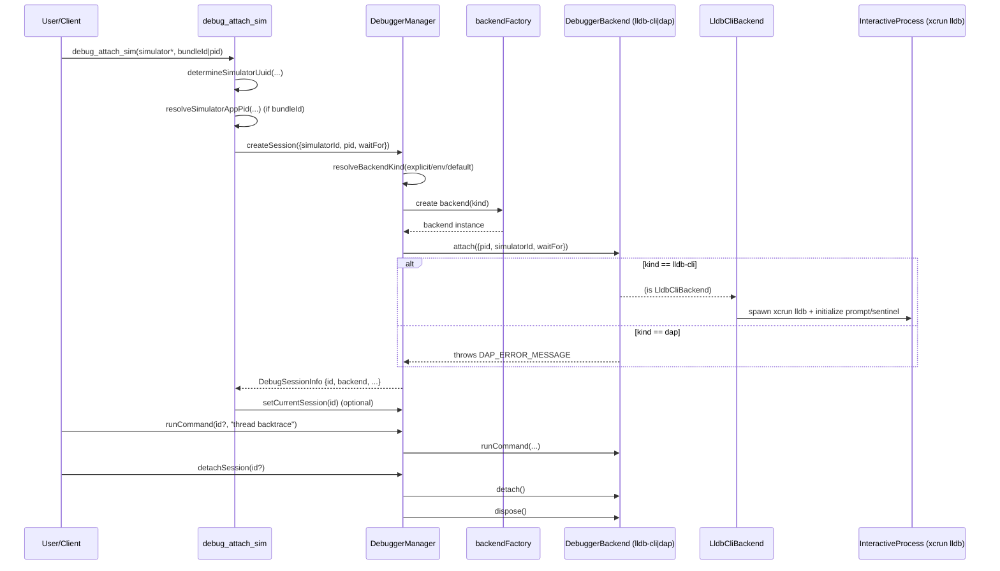
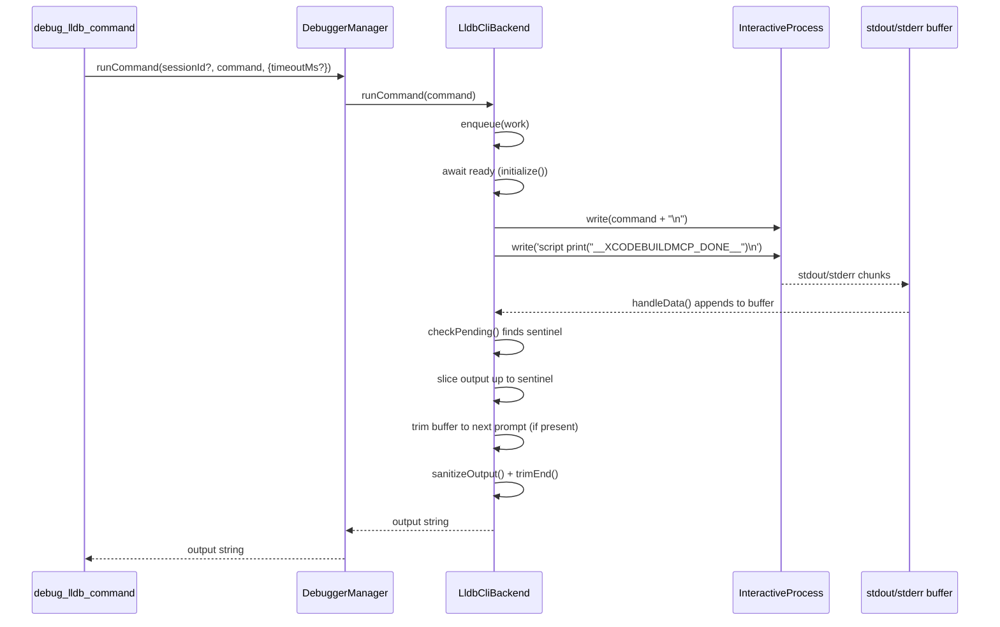

# Debugging Architecture

This document describes how the simulator debugging tools are wired, how sessions are managed,
and how external tools (simctl, Simulator, LLDB, xcodebuild) are invoked.

## Scope

- Tools: `src/mcp/tools/debugging/*`
- Debugger subsystem: `src/utils/debugger/*`
- Execution and tool wiring: `src/utils/typed-tool-factory.ts`, `src/utils/execution/*`
- External invocation: `xcrun simctl`, `xcrun lldb`, `xcodebuild`

## Registration and Wiring

- Workflow discovery is automatic: `src/core/plugin-registry.ts` loads debugging tools via the
  generated workflow loaders (`src/core/generated-plugins.ts`).
- Tool handlers are created with the typed tool factory:
  - `createTypedToolWithContext` for standard tools (Zod validation + dependency injection).
  - `createSessionAwareToolWithContext` for session-aware tools (merges session defaults and
    validates requirements).
- Debugging tools inject a `DebuggerToolContext` that provides:
  - `executor`: a `CommandExecutor` used for simctl and other command execution.
  - `debugger`: a shared `DebuggerManager` instance.

## Session Defaults and Validation

- Session defaults live in `src/utils/session-store.ts` and are merged with user args by the
  session-aware tool factory.
- `debug_attach_sim` is session-aware; it can omit `simulatorId`/`simulatorName` in the public
  schema and rely on session defaults.
- The `XCODEBUILDMCP_DISABLE_SESSION_DEFAULTS` env flag exposes legacy schemas that include all
  parameters (no session default hiding).

## Debug Session Lifecycle

`DebuggerManager` owns lifecycle, state, and backend routing:

Backend selection happens inside `DebuggerManager.createSession`:

- Selection order: explicit `backend` argument -> `XCODEBUILDMCP_DEBUGGER_BACKEND` -> default `lldb-cli`.
- Env values: `lldb-cli`/`lldb` -> `lldb-cli`, `dap` -> `dap`, anything else throws.
- Backend factory: `defaultBackendFactory` maps `lldb-cli` to `createLldbCliBackend` and `dap` to
  `createDapBackend`. A custom factory can be injected for tests or extensions.

1. `debug_attach_sim` resolves simulator UUID and PID, then calls
   `DebuggerManager.createSession`.
2. `DebuggerManager` creates a backend (default `lldb-cli`), attaches to the process, and stores
   session metadata (id, simulatorId, pid, timestamps).
3. Debugging tools (`debug_lldb_command`, `debug_stack`, `debug_variables`,
   `debug_breakpoint_add/remove`) look up the session (explicit id or current) and route commands
   to the backend.
4. `debug_detach` calls `DebuggerManager.detachSession` to detach and dispose the backend.

## Debug Session + Command Execution Flow

Session lifecycle flow (text):

1. Client calls `debug_attach_sim`.
2. `debug_attach_sim` resolves simulator UUID and PID, then calls `DebuggerManager.createSession`.
3. `DebuggerManager.createSession` resolves backend kind (explicit/env/default), instantiates the
   backend, and calls `backend.attach`.
4. Command tools (`debug_lldb_command`, `debug_stack`, `debug_variables`) call
   `DebuggerManager.runCommand`/`getStack`/`getVariables`, which route to the backend.
5. `debug_detach` calls `DebuggerManager.detachSession`, which invokes `backend.detach` and
   `backend.dispose`.

`LldbCliBackend.runCommand()` flow (text):

1. Enqueue the command to serialize LLDB access.
2. Await backend readiness (`initialize` completed).
3. Write the command to the interactive process.
4. Write `script print("__XCODEBUILDMCP_DONE__")` to emit the sentinel marker.
5. Buffer stdout/stderr until the sentinel is detected.
6. Trim the buffer to the next prompt, sanitize output, and return the result.

Sequence diagrams (Mermaid)

## LLDB CLI Backend (Default)

- Backend implementation: `src/utils/debugger/backends/lldb-cli-backend.ts`.
- Uses `InteractiveSpawner` from `src/utils/execution/interactive-process.ts` to keep a single
  long-lived `xcrun lldb` process alive.
- Keeps LLDB state (breakpoints, selected frames, target) across tool calls without reattaching.

### Internals: interactive process model

- The backend spawns `xcrun lldb --no-lldbinit -o "settings set prompt <prompt>"`.
- `InteractiveProcess.write()` is used to send commands; stdout and stderr are merged into a single
  parse buffer.
- `InteractiveProcess.dispose()` closes stdin, removes listeners, and kills the process.

### Prompt and sentinel protocol

The backend uses a prompt + sentinel protocol to detect command completion reliably:

- `LLDB_PROMPT = "XCODEBUILDMCP_LLDB> "`
- `COMMAND_SENTINEL = "__XCODEBUILDMCP_DONE__"`

Definitions:

- Prompt: the LLDB REPL prompt string that indicates LLDB is ready to accept the next command.
- Sentinel: a unique marker explicitly printed after each command to mark the end of that
  command's output.

Protocol flow:

1. Startup: write `script print("__XCODEBUILDMCP_DONE__")` to prime the prompt parser.
2. For each command:
   - Write the command.
   - Write `script print("__XCODEBUILDMCP_DONE__")`.
   - Read until the sentinel is observed, then trim up to the next prompt.

The sentinel marks command completion, while the prompt indicates the REPL is ready for the next
command.

Why both a prompt and a sentinel?

- The sentinel is the explicit end-of-output marker; LLDB does not provide a reliable boundary for
  arbitrary command output otherwise.
- The prompt is used to cleanly align the buffer for the next command after the sentinel is seen.

Annotated example (simplified):

1. Backend writes:
   - `thread backtrace`
   - `script print("__XCODEBUILDMCP_DONE__")`
2. LLDB emits (illustrative):
   - `... thread backtrace output ...`
   - `__XCODEBUILDMCP_DONE__`
   - `XCODEBUILDMCP_LLDB> `
3. Parser behavior:
   - Sentinel marks the end of the command output payload.
   - Prompt is used to trim the buffer, so the next command starts cleanly.

### Output parsing and sanitization

- `handleData()` appends to an internal buffer, and `checkPending()` scans for the sentinel regex
  `/(^|\\r?\\n)__XCODEBUILDMCP_DONE__(\\r?\\n)/`.
- Output is the buffer up to the sentinel. The remainder is trimmed to the next prompt, if present.
- `sanitizeOutput()` removes prompt echoes, sentinel lines, the `script print(...)` lines, and empty
  lines, then `runCommand()` returns `trimEnd()` output.

### Concurrency model (queueing)

- Commands are serialized through a promise queue to avoid interleaved output.
- `waitForSentinel()` rejects if a pending command exists, acting as a safety check.

### Timeouts, errors, and disposal

- Startup timeout: `DEFAULT_STARTUP_TIMEOUT_MS = 10_000`.
- Per-command timeout: `DEFAULT_COMMAND_TIMEOUT_MS = 30_000` (override via `runCommand` opts).
- Timeout failure clears the pending command and rejects the promise.
- `assertNoLldbError()` throws if `/error:/i` appears in output (simple heuristic).
- Process exit triggers `failPending(new Error(...))` so in-flight calls fail promptly.
- `runCommand()` rejects immediately if the backend is already disposed.

### Testing and injection

`getDefaultInteractiveSpawner()` throws in test environments to prevent spawning real interactive
processes. Tests should inject a mock `InteractiveSpawner` into `createLldbCliBackend()` or a custom
`DebuggerManager` backend factory.

## DAP Backend (lldb-dap)

- Implementation: `src/utils/debugger/backends/dap-backend.ts`, with protocol support in
  `src/utils/debugger/dap/transport.ts`, `src/utils/debugger/dap/types.ts`, and adapter discovery in
  `src/utils/debugger/dap/adapter-discovery.ts`.
- Selected via backend selection (explicit `backend`, `XCODEBUILDMCP_DEBUGGER_BACKEND=dap`, or default when unset).
- Adapter discovery uses `xcrun --find lldb-dap`; missing adapters raise a clear dependency error.
- One `lldb-dap` process is spawned per session; DAP framing and request correlation are handled
  by `DapTransport`.
- Session handshake: `initialize` → `attach` → `configurationDone`.
- Breakpoints are stateful: adding/removing re-issues `setBreakpoints` or
  `setFunctionBreakpoints` with the remaining list. Conditions are passed in the request body.
- Stack/variables typically require a stopped thread; the backend returns guidance if the process
  is still running.

## External Tool Invocation

### simctl and Simulator

- Simulator UUID resolution uses `xcrun simctl list devices available -j`
  (`determineSimulatorUuid` in `src/utils/simulator-utils.ts`).
- PID lookup uses `xcrun simctl spawn <simulatorId> launchctl list`
  (`resolveSimulatorAppPid` in `src/utils/debugger/simctl.ts`).

### LLDB

- Attachment uses `xcrun lldb --no-lldbinit` in the interactive backend.
- Breakpoint conditions are applied internally by the LLDB CLI backend using
  `breakpoint modify -c "<condition>" <id>` after creation.

### xcodebuild (Build/Launch Context)

- Debugging assumes a running simulator app.
- The typical flow is to build and launch via simulator tools (for example `build_sim`),
  which uses `executeXcodeBuildCommand` to invoke `xcodebuild` (or `xcodemake` when enabled).
- After launch, `debug_attach_sim` attaches LLDB to the simulator process.

## Typical Tool Flow

1. Build and launch the app on a simulator (`build_sim`, `launch_app_sim`).
2. Attach LLDB (`debug_attach_sim`) using session defaults or explicit simulator + bundle ID.
3. Set breakpoints (`debug_breakpoint_add`), inspect stack/variables (`debug_stack`,
   `debug_variables`), and issue arbitrary LLDB commands (`debug_lldb_command`).
4. Detach when done (`debug_detach`).

## Integration Points Summary

- Tool entrypoints: `src/mcp/tools/debugging/*`
- Session defaults: `src/utils/session-store.ts`
- Debug session manager: `src/utils/debugger/debugger-manager.ts`
- Backends: `src/utils/debugger/backends/lldb-cli-backend.ts` (default),
  `src/utils/debugger/backends/dap-backend.ts`
- Interactive execution: `src/utils/execution/interactive-process.ts` (used by LLDB CLI backend)
- External commands: `xcrun simctl`, `xcrun lldb`, `xcodebuild`
